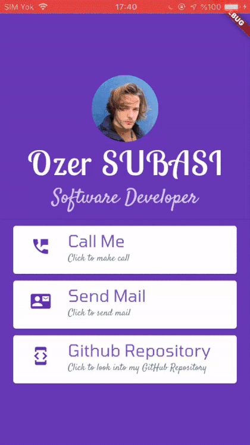

# personal_card_flutter

This Personal Card developed with Flutter.
I used a lot of Widgets while developing it. I also use an "onTap()" method to actively use button click events. I imported "url_launcher" package for use the method.

While doing this project, I learned a lot about the using of Widgets and the editing of the visuals thanks to the documentation and speeded myself.

While I'm uploading the project to GitHub, sometimes I'm using Fork, terminal is also good option for that.

There is a demo below,

